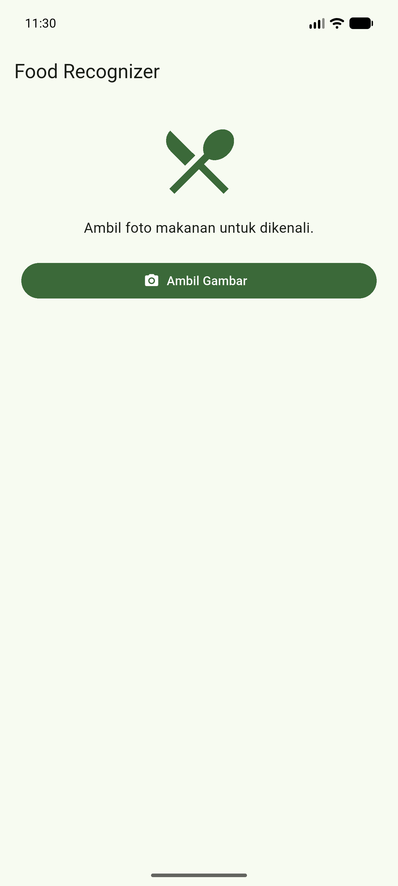
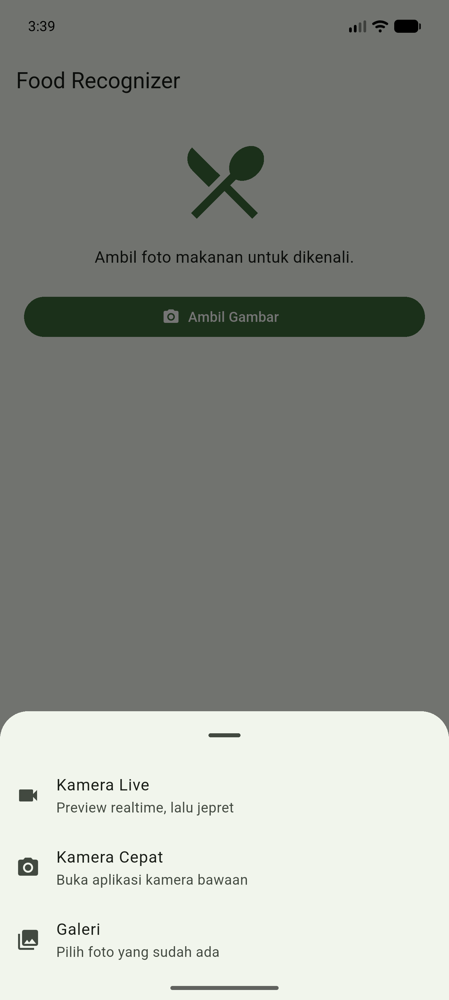
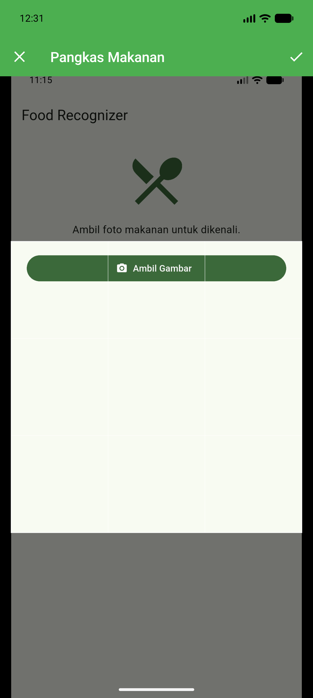
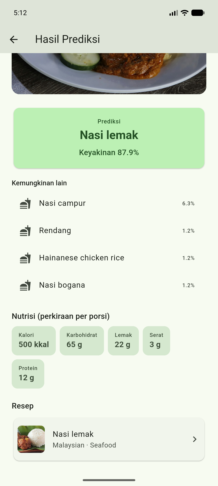
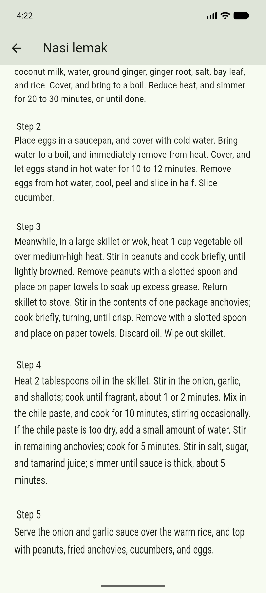

# 🍽️ Food Recognizer

> Aplikasi Flutter yang mengenali **makanan dari foto** secara *on-device* dengan
> TensorFlow Lite (LiteRT), lalu menampilkan **prediksi**, **resep**, dan
> **estimasi nutrisi**.

Submission akhir untuk kelas Dicoding *Belajar Penerapan Machine Learning untuk
Flutter* — dikerjakan bertingkat sampai **tier Advanced** di ketiga kriteria.

---

## ✨ Fitur

| Kriteria | Fitur |
|---|---|
| **1. Ambil gambar** | Kamera live (`camera`) · Kamera cepat & Galeri (`image_picker`) · Crop 1:1 (`image_cropper`) |
| **2. Machine Learning** | Klasifikasi TFLite (`tflite_flutter`) · inferensi di **Isolate** (UI anti-freeze) · model diunduh dinamis dari **Firebase Storage** |
| **3. Halaman prediksi** | Foto + nama + confidence · resep terkait dari **MealDB API** · estimasi nutrisi dari **Gemini API** (structured output) |

Alur singkat:

```
Ambil/pilih foto → Crop 1:1 → Analisis
    → unduh model dari cloud (sekali, lalu cache) → inferensi di Isolate
    → Nama makanan + confidence + 4 alternatif
    → Nutrisi (Gemini) + Resep (MealDB)
```

---

## 📸 Tampilan

| Beranda | Sumber gambar | Kamera live |
|---|---|---|
|  |  |  |

| Crop 1:1 | Hasil prediksi + nutrisi | Resep |
|---|---|---|
|  |  |  |

---

## 🧠 Tentang model ML

- Model: Kaggle [`google/aiy/tfLite/vision-classifier-food-v1`](https://www.kaggle.com/models/google/aiy/tfLite/vision-classifier-food-v1).
- Input **192×192 RGB (uint8)**, output probabilitas atas **2023 kelas makanan**.
- Model **hanya** mengklasifikasi nama makanan — tidak menilai layak-makan,
  tidak menyusun bahan, tidak mengestimasi nutrisi, tidak menolak non-makanan.
  Karena itu: **bahan → MealDB**, **nutrisi → Gemini**.
- Model **tidak dibundel** dalam aplikasi (ukurannya ±20 MB); diunduh dari
  **Firebase Storage** saat pertama dipakai, lalu di-cache lokal.

---

## 🛠️ Tech stack

- **Flutter** (Dart) — satu basis kode untuk Android, iOS, web, & desktop.
- **State management:** `provider` (pola `ChangeNotifier`).
- **ML:** `tflite_flutter` + `image` + Dart `Isolate`.
- **Cloud:** `firebase_core` + `firebase_storage` (model), `http` (MealDB & Gemini).
- **Config rahasia:** `flutter_dotenv` (`GEMINI_API_KEY` dari `.env`).

---

## 🏗️ Struktur proyek

```
lib/
├── main.dart          # entry: MultiProvider → MaterialApp → HomePage
├── controller/        # state + orkestrasi (ChangeNotifier)
├── service/           # akses "luar": image picker, ML, MealDB, Gemini
├── model/             # class data murni (Classification, Recipe, Nutrition)
├── ui/                # halaman penuh (Home, Result, Camera, RecipeDetail)
└── widget/            # widget reusable
```

Pola: `controller` menyimpan state & memanggil `service`; `service` yang
benar-benar mengakses ML/API; `ui` membaca state via `context.watch`/`read`.

---

## 🚀 Menjalankan

> Panduan setup lengkap dari nol (model, Firebase, Gemini, troubleshooting) ada di **[SETUP.md](SETUP.md)**.

**Prasyarat:** Flutter SDK (stable terbaru), perangkat/emulator Android.

```bash
flutter pub get
flutter run
```

### ⚙️ Konfigurasi Gemini API key (fitur nutrisi)

Estimasi nutrisi memakai **Gemini API**. Key **tidak** disertakan di repo — buat
file `.env` dari template:

```bash
cp .env.example .env
```

lalu isi key gratis dari [Google AI Studio](https://aistudio.google.com/apikey):

```env
GEMINI_API_KEY=isi_key_kamu_di_sini
```

> Tanpa `.env`, aplikasi tetap jalan — hanya bagian **Nutrisi** yang
> menampilkan pesan bahwa key belum diatur.

---

## 🧪 Testing

```bash
flutter test      # unit & widget test (mock service/HTTP, tanpa jaringan)
flutter analyze   # linter
```

---

## 📝 Catatan pengembangan

- Proyek belajar: saya **baru di Flutter**, memulai dari starter code yang
  direferensikan tim Dicoding, lalu membangun tiap fitur secara bertahap.
- Banyak **komentar** sengaja ditulis di kode sebagai catatan belajar — agar
  alasan tiap keputusan (idiom Flutter, cara kerja package, integrasi ML)
  mudah diingat kembali.
- Riwayat dikelola dengan **Git Flow** (branch `feat/*` → `develop` → `main`).

---

## 🙏 Kredit

- Kelas **Dicoding — Belajar Penerapan Machine Learning untuk Flutter**.
- Model makanan: **Google AIY** (via Kaggle).
- Resep: [**TheMealDB**](https://www.themealdb.com/). Nutrisi: **Google Gemini**.
